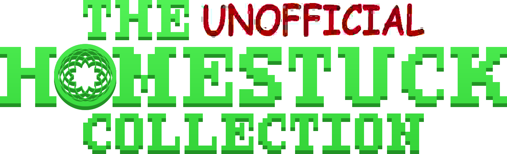

Homepage: <https://homestuck.giovanh.com/unofficial-homestuck-collection/>

---

The future of The Unofficial Homestuck Collection is currently uncertain. 

The surrounding websites have been taken down by legal action initiated by Homestuck, Inc. and The Homestuck Independent Creative Union as part of an attempted hostile takeover. [More details here.](https://blog.giovanh.com/blog/2025/08/08/uhc-end/)

There have currently been no legal attacks on this, the codebase for the reader. 
The question of whether this repository can remain up or maintained without the threat of retaliatory legal action is under active investigation. 

---

This is the repository for a self-contained collection that contains Homestuck (with Flash elements fully intact), the other MS Paint Adventures, official Homestuck side-stories, and a variety of goodies for the enquiring reader, as well as a variety of unintrusive enhancements to the overall presentation, both for quality and convenience.

To run The Unofficial Homestuck Collection, you need to pair this application with a pack of assets designed specifically to integrate with it. A decent amount of effort has been made to keep this repository free from the majority of that copyrighted content, and (at least for now), it won't contain a link to the place you can find it.

## Some details on the codebase

This application runs entirely in Electron + Vue, with very little else going on. Although it functions in a manner very similar to a web browser, everything is running in what I would charitably describe as a "creative" fashion. I am by no means an expert, and while I'd love to say I always had good practices in mind while developing this, I largely didn't even know what a good practice *was* for a decent chunk of it.

So what I'm saying is this: You're welcome to peruse the codebase, fork it, make and suggest changes, or use it in any way you see fit. Just uh... don't expect it to be well formed or documented in any of the ways that really count. If you want to make some changes and my code is causing you physical discomfort, [try asking around our Discord server.](https://discord.gg/43QHASFC2X) Someone should be able to help out!

Building a development version of TUHC requires NPM (Node 14.18), Yarn, `make`, and `tar`.

- NPM is the node package manager, used for developing with Node.js.
- [Yarn](https://www.npmjs.com/package/yarn) is a npm-like package manager that is itself distributed as an NPM package.
- `tar` and `make` are basic GNU utilities used extremely commonly in software development. `tar` is used to pack files (like zip) and `make` is used to build projects with dependencies. If you don't already have them on your system (you can maintain robust CLI environments using tools like [cygwin](https://www.cygwin.com) or [WSL](https://docs.microsoft.com/en-us/windows/wsl/install)), you can download [`tar`](http://gnuwin32.sourceforge.net/packages/gtar.htm) and [`make`](https://www.gnu.org/software/make/) individually directly from GNU.

## Credits

The Unofficial Homestuck Collection was created by [Bambosh](https://bambosh.dev) and is currently maintained by [GiovanH](https://im.giovanh.com).
[A lot of people](https://github.com/GiovanH/unofficial-homestuck-collection/graphs/contributors) have contributed to the success of this project and I am deeply grateful to all of them. 
A full list of contributors and thanks can be found in the program itself under the Credits page.

## Legal

<pre>The Unofficial Homestuck Collection
Copyright (C) 2025 GiovanH

This program is free software: you can redistribute it and/or modify
it under the terms of the <a href="https://www.gnu.org/licenses">GNU General Public License</a> as published by
the Free Software Foundation, either version 3 of the License, or
(at your option) any later version.
</pre>

As per section 7, an additional requirement of this license is that all attribution and crediting must be preserved. Modifications that remove
attribution or otherwise misrepresent the authorship or origin of material
are not permitted and violate the license conditions. 

---

In (non legally-binding) summary, you may freely use and distribute the software, as well as modify it and distribute your changes and modified versions, so long as you do not restrict the rights of others to do the same. You must clearly notate any changes and provide links to the unmodified original, and not remove credits.
